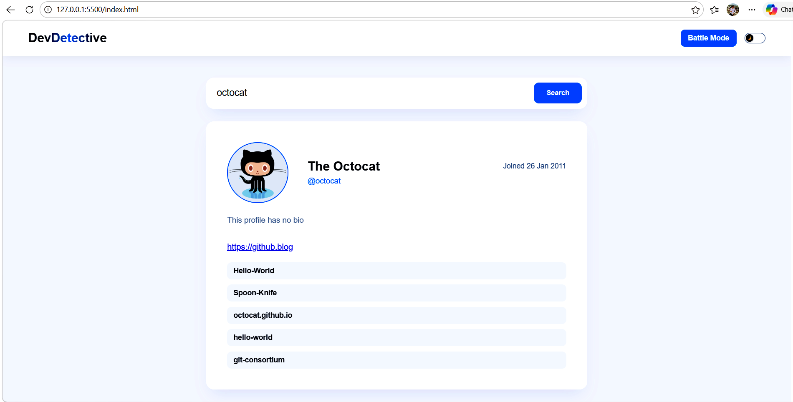
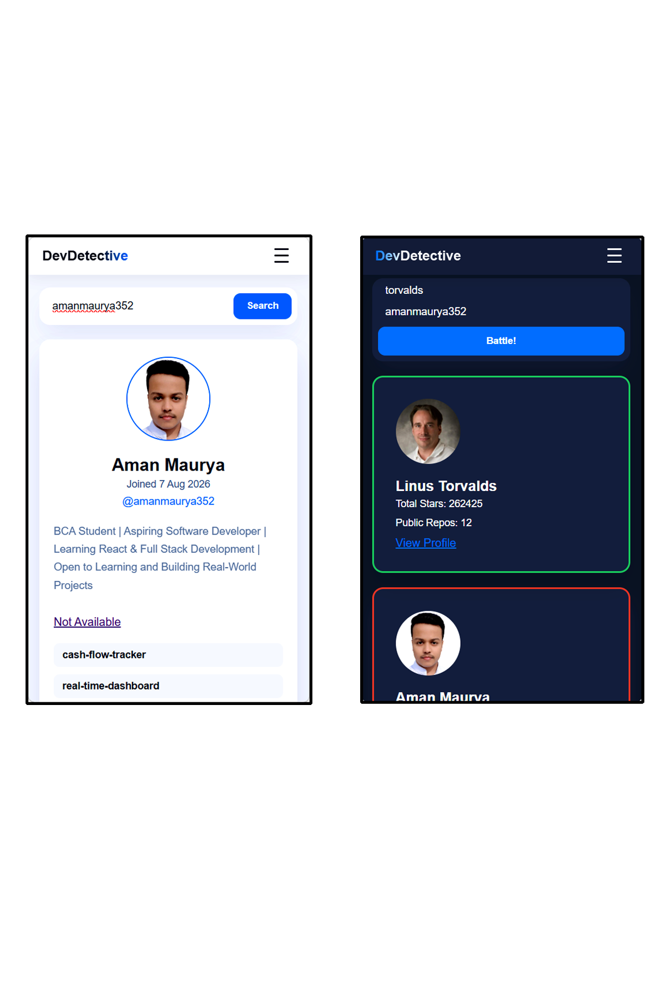
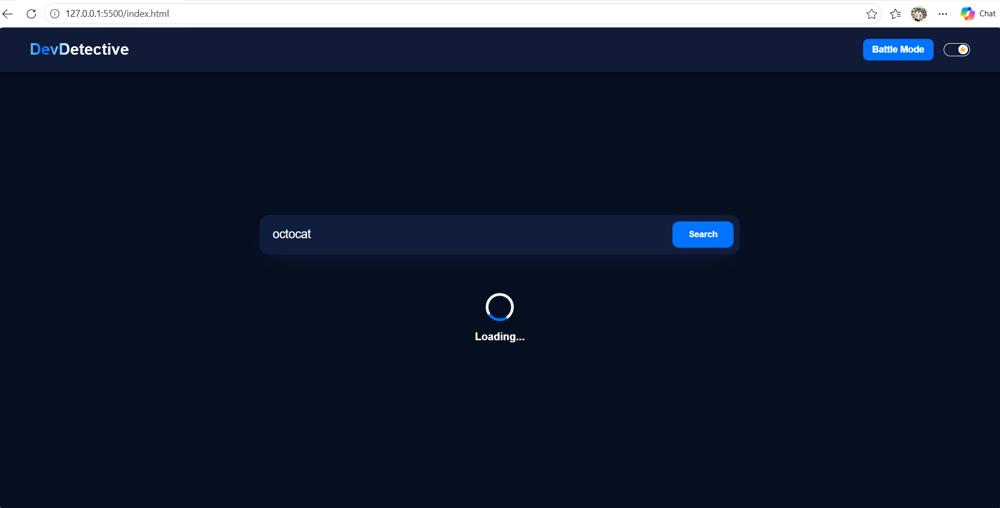
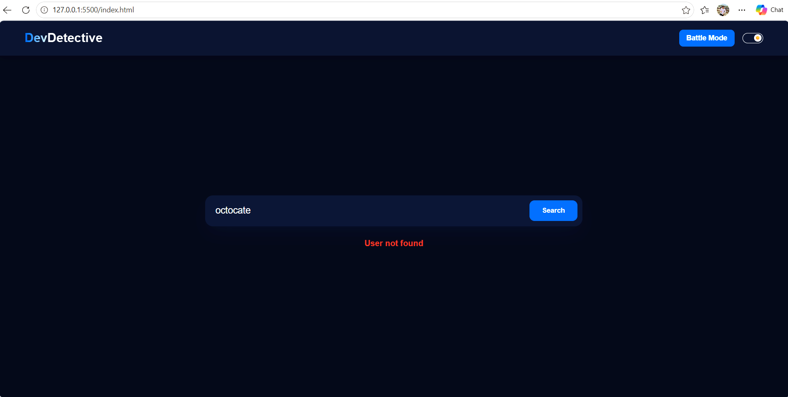
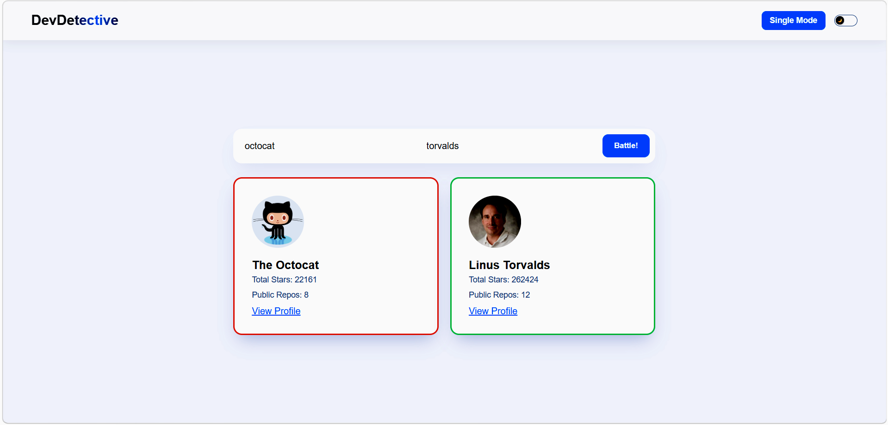

# Dev-Detective — GitHub User Profile & Battle Analyzer

A responsive web application built with Vanilla JavaScript that interfaces directly with the official GitHub REST API, featuring asynchronous data fetching, dynamic profile rendering, repository inspection, and a head-to-head developer "Battle Mode" with star calculations.

## Live Website
https://dev-detective-aman.netlify.app

## Features

### Dynamic Profile Search:
Instant asynchronous retrieval and rendering of user profiles including avatars, custom names, bios, formatted join dates, and portfolio links.

### Repository Inspector:
Automatic endpoint chaining to fetch and display a user's top 5 latest public repositories with clickable external links.

### ISO Date Formatting:
Utility logic that converts raw ISO timestamps into clean, human-readable strings (e.g., "25 Jan 2023").

### Developer Battle Mode:
Dual-username input system powered by Promise.all() to fetch two accounts simultaneously, calculate total repository stars, and conditionally highlight the winner (green border) and loser (red border).

### Robust State Management:
Built-in UI loading indicators and graceful 404 error handling for invalid or non-existent GitHub usernames without app crashes.

### Responsive UI & Navigation:
Sticky translucent header with a frosted-glass backdrop filter, text-gradient shimmer title, custom sliding pill theme toggle, and a mobile-optimized right-to-left sliding hamburger menu drawer.

### Theme Persistence:
Seamless Light and Dark mode switching with persistent state management across page reloads.

## Tech Stack

HTML5 (Semantic Markup & Responsive Structure)

Vanilla CSS3 (Custom Properties, Flexbox, Grid, Frosted Glass Effects, Custom Animations)

JavaScript (ES6+) (DOM Manipulation, Async/Await, Fetch API, Promise.all)

GitHub REST API (User and Repository Endpoints)

## Project Structure

dev-detective/
├── public/
│   └── screenshots/
│       ├── desktop.png
│       ├── mobile.png
│       └── dark-mode.png
├── index.html
├── style.css
├── script.js
├── Prompts.md
└── README.md

## Project Screenshots

### Desktop View:

### Mobile View:

### Core Feature (Dark Mode & Battle Mode):

